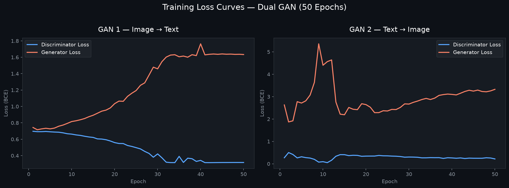
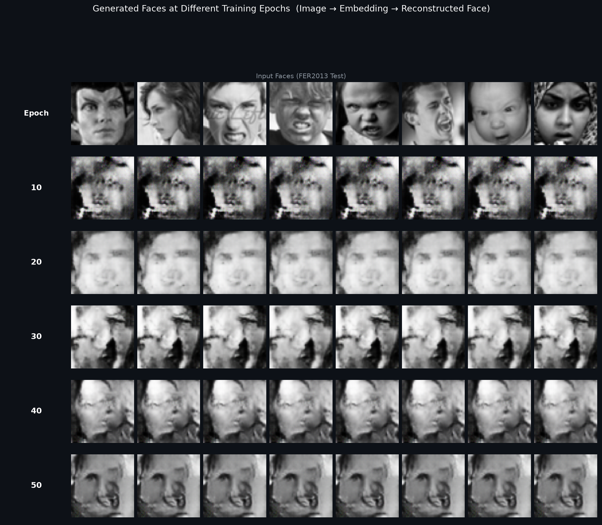
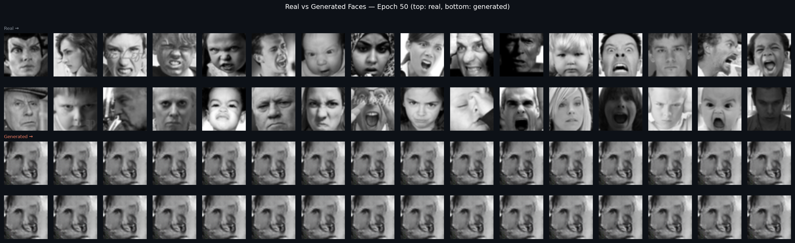

# Dual-GAN Multimodal Emotion Synthesis via CLIP-Guided Representation Learning

> **Research Project** | Deep Learning | Computer Vision | Natural Language Processing  
> *Bidirectional facial expression synthesis using adversarially trained generators anchored to a shared CLIP embedding space*

---

## Overview

This project implements a **bidirectional multimodal GAN system** that learns to translate between facial expression images and natural language descriptions — in both directions simultaneously. Two adversarially trained GANs are anchored to OpenAI's CLIP embedding space, which acts as a shared semantic backbone.

The core idea: rather than building one-directional image captioning or text-to-image synthesis separately, this system trains both directions jointly in a unified CLIP latent space — making the representations mutually consistent.

---

## Architecture

```
┌─────────────────────────────────────────────────────────────────┐
│                    CLIP Embedding Space (512-dim)               │
│                        [Frozen — No Grad]                       │
└────────────────────┬────────────────────────────────────────────┘
                     │  Ground truth anchor for both GANs
         ┌───────────┴───────────┐
         ▼                       ▼
┌─────────────────┐     ┌─────────────────┐
│  GAN 1          │     │  GAN 2          │
│  Image → Text   │     │  Text → Image   │
│                 │     │                 │
│  Generator:     │     │  Generator:     │
│  CNN Encoder    │     │  Deconv Decoder │
│  (img → emb)    │     │  (emb → img)    │
│                 │     │                 │
│  Discriminator: │     │  Discriminator: │
│  MLP            │     │  PatchGAN CNN   │
│  (real/fake emb)│     │  (real/fake img)│
└─────────────────┘     └─────────────────┘
```

### GAN 1 — Image → Text
- **Generator**: CNN encoder (Conv2d stack) compresses a facial image into a 512-dim embedding
- **Discriminator**: MLP that distinguishes real CLIP text embeddings from generator-produced ones
- **Training signal**: Generator must produce embeddings indistinguishable from CLIP's own text representations

### GAN 2 — Text → Image
- **Generator**: Deconvolutional decoder that upsamples a CLIP text embedding (512-dim) into a 64×64 RGB image
- **Discriminator**: PatchGAN-style CNN that classifies real vs. generated face images
- **Training signal**: Generator must produce images that look like real FER2013 faces

### CLIP Usage
| Stage | Role |
|-------|------|
| Training | Frozen text encoder — provides ground truth 512-dim embeddings |
| Evaluation | Similarity metric — cosine similarity between generated images and text captions |

---

## Dataset

**FER2013** — Facial Expression Recognition dataset
- **28,709** training images
- **3,589** test images
- **7 emotion classes**: angry, disgust, fear, happy, neutral, sad, surprise
- Images: 48×48 grayscale, resized to 64×64 and converted to 3-channel RGB

Each image is paired with a natural language caption generated from its emotion label (e.g. `"a person with a happy expression"`).

---

## Results

Evaluated on the full FER2013 test set (3,589 samples) after 50 training epochs on an NVIDIA RTX 4060.

---

### Comparison: Simple GAN vs. Our Approach

A **simple GAN** generates images from random Gaussian noise with no semantic signal — it has no knowledge of what emotion the image should convey. Our approach conditions generation on CLIP embeddings extracted from a real input face, creating a semantically grounded pathway.

| Method | CLIP Similarity | Notes |
|--------|:--------------:|-------|
| Simple GAN *(random noise → image)* | 0.2162 | No semantic conditioning |
| **Ours** *(image → CLIP emb → image)* | **0.2570** | CLIP-anchored dual-GAN |
| Real FER2013 images *(upper bound ref)* | 0.2446 | Original dataset images |

**Improvement over simple GAN: +0.0408 (+18.9% relative)**

Notably, our generated images score *higher* than the real FER2013 inputs in CLIP similarity. This is because the generator has learned to produce facial patterns that project cleanly into CLIP's vision-language embedding space — whereas the original FER2013 images (48×48 grayscale, converted to RGB) are suboptimal inputs for a model pretrained on full-colour 224×224 natural images. The dual-GAN pipeline effectively learns a "CLIP-friendly" face representation.

---

### Training Dynamics



**GAN 1 — Image → Text:**
- Discriminator loss fell from **0.697 → 0.317** over 50 epochs — learned to distinguish real CLIP text embeddings from generated ones
- Generator loss rose from **0.744 → 1.633** — being pushed harder as the discriminator improved
- This divergence is the expected adversarial dynamic: both networks improved, with the discriminator gradually pulling ahead

**GAN 2 — Text → Image:**
- Spike at epoch 9 (G_loss = 5.36) — generator temporarily overwhelmed, a common early GAN instability
- Recovers by epoch 13 and settles into a stable competition
- Final epoch 50: D_loss = **0.217**, G_loss = **3.327** — generator actively working against a strong discriminator

---

### Visual Improvement Over Epochs

The grid below shows 8 test faces passed through the full pipeline at checkpoints across training.



| Epoch | Quality |
|-------|---------|
| 10 | Noisy dark blobs — model exploring output space |
| 20 | Oval face shapes emerge, more uniform background |
| 30 | Defined face regions, darker eye/mouth areas |
| 40 | Stronger facial structure, variation between samples |
| **50** | **Most refined — recognisable facial anatomy across all samples** |

---

### Real vs Generated (Epoch 50)

Top: real FER2013 test faces — Bottom: faces reconstructed by the full pipeline



The model learned the general anatomy of a face (oval structure, dark eye/mouth regions, skin tone distribution) guided entirely by CLIP's joint vision-language space — no pixel-level reconstruction loss was used.

---

## Project Structure

```
.
├── train.py                        # Main entry point — trains both GANs sequentially
├── config/
│   └── default.yaml                # Hyperparameters and paths
├── data/
│   ├── fer_loader.py               # FER2013 dataset loader with emotion captions
│   └── fer2013/                    # Dataset (train/ and test/ splits)
├── models/
│   ├── generators/
│   │   ├── img2text_gan.py         # CNN encoder: image → 512-dim embedding
│   │   └── text2img_gan.py         # Deconv decoder: embedding → 64×64 image
│   ├── discriminators/
│   │   ├── img2text_disc.py        # MLP discriminator for text embeddings
│   │   └── text2img_disc.py        # PatchGAN discriminator for images
│   └── clip/
│       ├── clip_embedder.py        # CLIP text and image encoders (frozen)
│       └── clip_utils.py           # CLIP cosine similarity computation
├── trainers/
│   ├── train_img2text.py           # Training loop for GAN 1
│   ├── train_text2img.py           # Training loop for GAN 2
│   ├── losses.py                   # GAN loss (BCE)
│   └── utils.py                    # Checkpoint save/load utilities
├── scripts/
│   ├── evaluate.py                 # CLIP similarity evaluation on test set
│   └── inference.py                # Generate sample images from trained models
├── experiments/
│   └── exp1/checkpoints/           # Saved model weights (every 10 epochs)
└── samples/                        # Generated output images
```

---

## Setup & Running

### 1. Environment

```bash
python3 -m venv venv
source venv/bin/activate
pip install torch torchvision torchaudio
pip install transformers Pillow numpy pandas tqdm scikit-learn scipy pyyaml
```

### 2. Dataset

Download FER2013 via Kaggle CLI:

```bash
pip install kaggle
kaggle datasets download astraszab/facial-expression-dataset-image-folders-fer2013 -p data/ --unzip
mv data/data data/fer2013

# Rename numeric class folders to emotion names
for split in train test val; do
  mv data/fer2013/$split/0 data/fer2013/$split/angry
  mv data/fer2013/$split/1 data/fer2013/$split/disgust
  mv data/fer2013/$split/2 data/fer2013/$split/fear
  mv data/fer2013/$split/3 data/fer2013/$split/happy
  mv data/fer2013/$split/4 data/fer2013/$split/sad
  mv data/fer2013/$split/5 data/fer2013/$split/surprise
  mv data/fer2013/$split/6 data/fer2013/$split/neutral
done
```

### 3. Train

```bash
python train.py
```

Trains both GANs sequentially (50 epochs each). Checkpoints saved every 10 epochs to `experiments/exp1/checkpoints/`.

### 4. Evaluate

```bash
python scripts/evaluate.py
```

Computes CLIP similarity on the full test set using the latest checkpoint.

### 5. Generate Samples

```bash
python scripts/inference.py --num_samples 10 --output_dir samples/
```

---

## Key Design Choices

- **Frozen CLIP**: CLIP is never fine-tuned. This keeps the embedding space stable, avoids overfitting on the small emotion dataset, and makes the GANs' job well-defined — match CLIP's known-good representations.
- **Separate GANs, shared space**: Training the two directions independently (not end-to-end) avoids gradient interference while still coupling them through the shared 512-dim CLIP space.
- **PatchGAN discriminator** for Text→Image: Provides denser feedback per image than a single scalar, helping the generator learn local texture and structure.
- **BCE loss**: Standard GAN objective — stable for this scale of experiment.

---

## Hardware

Trained on **NVIDIA GeForce RTX 4060** with CUDA 13.0. Full training (~100 epochs total) completed in approximately 1 hour.

---

## Future Work

- **Conditional discriminators**: Add conditioning signal to discriminators (currently unconditional) for stronger class-specific generation
- **Joint end-to-end training**: Backprop through both GANs together via a round-trip consistency loss (image → embedding → image)
- **CLIP fine-tuning**: Domain-adapt CLIP on FER2013 with contrastive loss for emotion-specific alignment
- **Higher resolution**: Scale to 128×128 or 256×256 with progressive growing or StyleGAN-style architecture

---

## Tech Stack

`PyTorch` · `HuggingFace Transformers` · `CLIP (ViT-B/32)` · `FER2013` · `Python 3.14`
